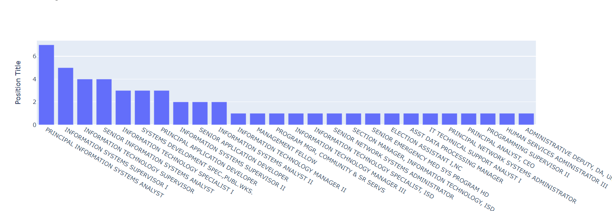

# LA County Career Path
> Find out what position people held prior to their promotion

This program analyzes data downloaded from the [County of Los Angeles Open Data](https://data.lacounty.gov/). It searches for people who are currently holding the item of interest, then, go back to their previous years to see what position they held prior to their promotion.


###### Position people held before becoming INFORMATION TECHNOLOGY SPECIALIST I


###### Position people held before becoming INFORMATION TECHNOLOGY MANAGER I


## Setup

Edit line 25 for the job of interest

```sh
target_job = 'INFORMATION TECHNOLOGY SPECIALIST I'
```

## Release History

* 0.1.0
    * Created DASH branch
* 0.0.1
    * Work in progress


[https://github.com/pilikiwi/LA_County_Career](https://github.com/pilikiwi/LA_County_Career)


<!-- Markdown link & img dfn's -->
[npm-image]: https://img.shields.io/npm/v/datadog-metrics.svg?style=flat-square
[npm-url]: https://npmjs.org/package/datadog-metrics
[npm-downloads]: https://img.shields.io/npm/dm/datadog-metrics.svg?style=flat-square
[travis-image]: https://img.shields.io/travis/dbader/node-datadog-metrics/master.svg?style=flat-square
[travis-url]: https://travis-ci.org/dbader/node-datadog-metrics
[wiki]: https://github.com/yourname/yourproject/wiki
